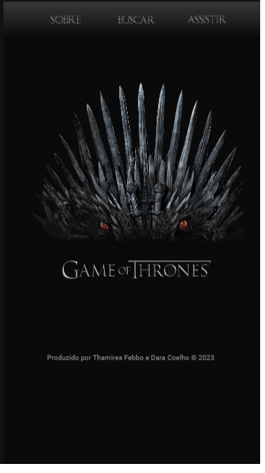
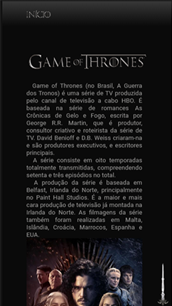
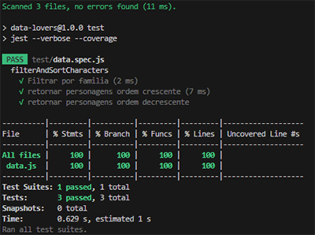

# Data Lovers - GOT

## Índice

* [1. Introdução](#1-introdução)
* [2. Resumo do projeto](#2-resumo-do-projeto)
* [3. Objetivos de aprendizagem](#3-objetivos-de-aprendizagem)
* [4. Considerações gerais](#4-considerações-gerais)

***

## 1. Introdução

Segundo a
[Data Lovers - GOT](https://febbex.github.io/SAP011-data-lovers/)
Lorem ipsum dolor sit amet, consectetur adipiscing elit, sed do eiusmod tempor incididunt ut labore et dolore magna aliqua. Quis ipsum suspendisse ultrices gravida. Risus commodo viverra maecenas accumsan lacus vel facilisis. 

## 2. Resumo do projeto

Neste projeto você **construirá uma _página web_ para visualizar um _conjunto
(set) de dados_** que se adeque às necessidades de seu usuário.

### Interface de Usuário

Como entregável final terá uma página web que permita **visualizar dados,
filtrá-los, ordená-los e fazer algum cálculo agregado**. Por cálculo agregado
nos referimos aos diversos cálculos que podem ser feitos com os dados para
mostrar a informação mais relevante para os usuários (médias, valores máximos e
mínimos, etc).

Para este projeto trazemos uma série de dados de _temáticas diferentes_ para que
você explore e decida com qual delas deseja trabalhar. Escolhemos
especificamente estes conjuntos de dados porque cremos que se adequem bem a esta
etapa de sua aprendizagem.

Uma vez que você defina sua área de interesse, busque entender quem é seu
usuário e o que exatamente ele necessita saber ou ver, para que assim possa
construir a interface que o ajude a interagir e entender melhor os dados.

O objetivo principal deste projeto é que aprenda a desenhar e construir uma
interface web onde se possa visualizar e manipular dados, entendendo o que o
usuário necessita.

### Interface de Usuário - Responsiva

* Versão Mobile

## 3. Definição do produto

Reflita e depois enumere os objetivos que quer alcançar e aplique no seu projeto. Pense nisso para decidir sua estratégia de trabalho.

### História do usuário 

- [ ] **Protótipo de média fidelidade**

  

Links

  * [Interface - idéia inicial](https://dataloversgot.my.canva.site/)

### Testes de usabilidade**
* Lorem ipsum dolor sit amet, consectetur adipiscing elit, sed do eiusmod tempor incididunt ut labore et dolore magna aliqua. Quis ipsum suspendisse ultrices gravida. Risus commodo viverra maecenas accumsan lacus vel facilisis. 

## 4. Testes unitários

